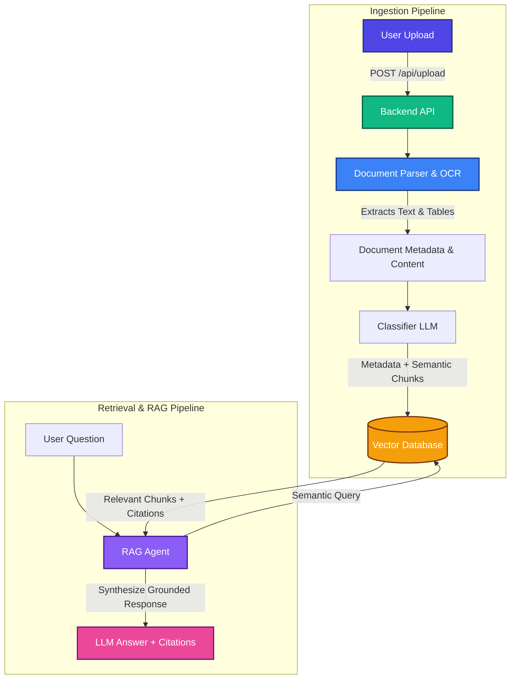

# DocuPulse Intelligence

A secure, high-performance Document Intelligence platform that ingests complex, real-world documents (scanned PDFs, handwritten pages, reports, and tables), extracts text and layout structures, runs automated LLM categorization, and powers an agentic, citation-backed RAG chatbot.

---

## 🔗 Live Demo & Video

* **Demo Video**: [Watch Demo Video](https://drive.google.com/file/d/1b23TGFjA3qyiMz4ax7mT9Gu3Wn7K-Z_b/view?usp=sharing)
* **Demo Live Link**: [Access DocPulse Live](https://docpulse-intelligence.onrender.com/)

---

## 🏗️ System Architecture

### Pipeline Flow

```
User Upload ──► Backend API ──► Document Parser (OCR/Layout) ──► Text + Images
                                                                     │
                                                                     ▼
                                                             Classifier (LLM)
                                                                     │
                                                                     ▼
                                                              Vector Database
                                                                     │
User Question ──► RAG Agent ──► Search/Retrieval ◄───────────────────┘
                    │
                    ▼
          LLM Answer + Citations (Grounded Source & Page Numbers)
```

### Flowchart Detail (Mermaid)



---

## 💡 Key Concepts

*   **RAG (Retrieval-Augmented Generation)**: A technique that retrieves relevant context from a knowledge base before passing it to the Large Language Model (LLM). This ensures the LLM's response is grounded in actual documents and minimizes hallucinations.
*   **Vector Database**: A local, persistent database (Chroma DB) optimized for storing and querying high-dimensional vectors representing semantic text meanings. This powers the semantic search capabilities of the chatbot.
*   **OCR (Optical Character Recognition)**: The technology used to scan and convert image-based files (scanned PDFs, handwritten pages, screenshots) into machine-readable text.
*   **Embeddings**: Mathematical vectors that represent the semantic meaning of a chunk of text, allowing the system to perform contextual similarity matching rather than simple keyword searches.

---

## 🛡️ Security Architecture

Security is integrated at every layer of the system:

1.  **Ingestion & Upload Layer**:
    *   **File Validation**: Magic numbers check (using python-magic) to verify actual MIME types (PDF, JPEG, PNG, TXT), preventing malicious executables disguised with fake extensions.
    *   **Filename Hashing**: renames file to its SHA-256 hash to completely neutralize directory/path traversal vulnerabilities (e.g. `../../config.json` is hashed to a safe alphanumeric name).
    *   **Payload Sanitization**: Scrubs user query inputs to prevent Cross-Site Scripting (XSS) or SQL injection patterns.
2.  **Storage Layer**:
    *   **Encryption at Rest**: Uploaded files are encrypted locally in the `storage/` directory using strong symmetric cryptography (Fernet AES-256) and unencrypted copies are deleted instantly.
3.  **Processing & Database Layer**:
    *   **Metadata Flattening**: Sanitizes and flattens metadata structures so they align with strict vector database schemas.

---

## 📂 Project Structure

```
doc-intelligence/
├── backend/
│   ├── main.py             # Main FastAPI server (Uploads, Chat, Status, Documents Index)
│   ├── parser.py           # Document OCR and structure parsing engine
│   ├── classifier.py       # Groq-based document categorizer
│   ├── vector_store.py     # Chroma DB client configuration (MiniLM-L6-v2)
│   ├── rag_agent.py        # Prompt constructor and LLM execution
│   ├── security.py         # File checking, name hashing, and AES encryption
│   ├── requirements.txt    # Python dependencies
│   ├── .env                # Secret keys (Groq & custom paths)
│   └── storage/            # Local encrypted files & task status logs
└── frontend/               # Next.js workspace
    ├── app/
    │   ├── page.tsx        # DocIntel AI - Landing Page
    │   ├── upload/
    │   │   └── page.tsx    # DocIntel AI - Upload Center
    │   └── chat/
    │       └── page.tsx    # DocIntel AI - Chat Assistant
    └── package.json
```

---

## 🚀 Getting Started

### Prerequisites
*   Python 3.9+
*   Node.js (v18+)

### Backend Setup

1. Navigate to the backend directory:
   ```bash
   cd backend
   ```

2. Create and activate a virtual environment:
   ```bash
   python -m venv venv
   # On Windows:
   venv\Scripts\activate
   # On macOS/Linux:
   source venv/bin/activate
   ```

3. Install dependencies:
   ```bash
   pip install -r requirements.txt
   ```

4. Configure your `.env` file:
   Create a `.env` in the `backend/` folder:
   ```env
   GROQ_API_KEY=your_groq_api_key
   # If Tesseract OCR or Poppler are not in your system Path:
   # TESSERACT_PATH=C:\Program Files\Tesseract-OCR\tesseract.exe
   # POPPLER_PATH=C:\poppler\Library\bin
   ```

5. Run the dev server:
   ```bash
   python -m uvicorn main:app --reload
   ```
   The API will be available at `http://localhost:8000`. Access Swagger UI docs at `http://localhost:8000/docs`.

### Frontend Setup

1. Navigate to the frontend directory:
   ```bash
   cd frontend
   ```

2. Install dependencies:
   ```bash
   npm install
   ```

3. Start the Next.js dev server:
   ```bash
   npm run dev
   ```
   Open `http://localhost:3000` in your browser to view the application.
